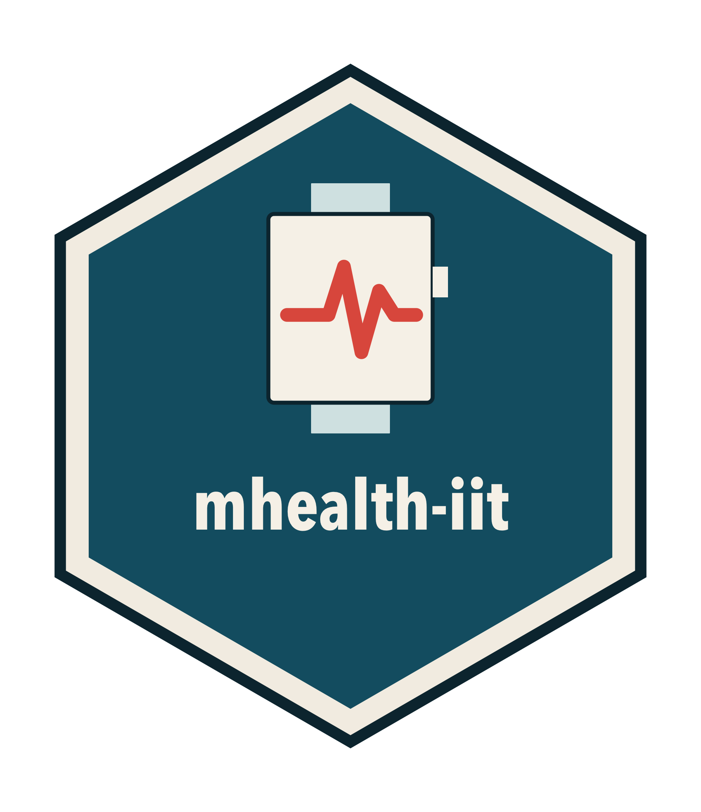

# mhealth-iit 

[](https://zenodo.org/badge/latestdoi/613128825)

**m**obile-**health** **i**nvestigator-**i**nitiated **t**rial

R tools for academic teams who want consumer wearable data inside an investigator-initiated trial. A Shiny app walks study staff through Fitbit consent at a visit, and example scripts then refresh those credentials and pull activity and heart-rate data from the Fitbit Web API.

A coordinator runs the app on a study computer. The participant signs in to Fitbit and approves sharing. The app stores the Fitbit user id and tokens the trial needs for later collection. Field testing for this workflow was in older adults with advanced lung cancer.

## What it does

1. **Consent a participant.** Build a Fitbit OAuth 2.0 authorization link (PKCE), have the participant approve access, and exchange the redirect for a user id, access token, and refresh token.
2. **Keep access alive.** Exchange a refresh token for a new access token. Fitbit rotates the refresh token, so the new value has to be saved.
3. **Pull trial measures.** Request daily summaries and 5-minute intraday series for steps, active zone minutes, and heart rate.

The consent link asks for these Fitbit scopes: activity, cardio fitness, heart rate, nutrition, oxygen saturation, profile, respiratory rate, settings, sleep, temperature, and weight.

## Repository layout

| Path | Role |
| --- | --- |
| `app/app.R` | Shiny app. Copy the consent link, paste the redirect URL, preview the tokens, and download a CSV. |
| `app/R/authorization-flow.R` | Builds the PKCE authorization URL and defines `grabAccessInfo()`. |
| `example_data-pull.R` | `getTokens()` and `pull*` functions for daily and intraday endpoints. Sourcing the file does not call the API. |
| `man/figures/logo.R` | Draws the hex sticker. `Rscript man/figures/logo.R` writes `man/figures/logo.png`. |

## Requirements

Install the packages the app and the examples load:

```r
install.packages(c("shiny", "curl", "httr", "httr2", "tidyverse", "rclipboard"))
```

You also need a Fitbit developer application and its client id. Token exchange is a public PKCE client: the request sends the client id, the authorization code, and the code verifier.

## Configure the Fitbit application

1. Create an application at [dev.fitbit.com](https://dev.fitbit.com/apps).
2. In `app/R/authorization-flow.R`, replace both `[INSERT FITBIT APP ID HERE]` placeholders with that client id. One is in the authorization URL. The other is in the token request inside `grabAccessInfo()`.
3. Register the application's callback URL in the Fitbit portal. The authorization URL leaves `redirect_uri` unset, so Fitbit sends the participant to the callback saved on the application. Copy the address bar after consent. The callback page itself can fail to render; the authorization code is in the URL.

Intraday heart rate and intraday active zone minutes need intraday access turned on for that Fitbit application. Daily summaries use the scopes above.

## Consent a participant

From the repository root, in RStudio open `app/app.R` and choose Run App, or run:

```r
shiny::runApp("app")
```

Sourcing `authorization-flow.R` creates one PKCE code challenge and the matching verifier. The consent link shown in the app and the token exchange both use that pair. Finish consent in the same R session that opened the app. Starting the app again creates a new challenge, and a link from the earlier session will not redeem.

In the app, titled "FitBit user consenting":

1. Copy the authorization URL with the clipboard button, or from the text field.
2. Open it in a browser. The participant signs in to Fitbit and approves the requested scopes.
3. Copy the full address-bar URL of the page Fitbit redirects to and paste it into **Authorization redirect url**. A trailing `#_=_` is fine to include. If the paste has no authorization `code`, the app asks for the full address bar again.
4. The table lists `user_id`, `access_token`, and `refresh_token`.
5. **Download access information** writes `{user_id}.csv`.

`grabAccessInfo()` reads the `code` parameter from the pasted URL and posts it, with the PKCE verifier, to `https://api.fitbit.com/oauth2/token`.

## Pull data after consent

`example_data-pull.R` defines functions and does not call the API when sourced. Load `httr` and `tidyverse` first. `getTokens()` also expects `url.token` from `authorization-flow.R` (`https://api.fitbit.com/oauth2/token`) and a `client.id` set to the same Fitbit client id:

```r
source("example_data-pull.R")
client.id <- "[your Fitbit client id]"
newtoks <- getTokens(refresh_token)

steps <- pullDailySteps(newtoks, "2024-01-01", "2024-01-07")
azm <- pullDailyActiveZoneMinutes(newtoks, "2024-01-01", "2024-01-07")
heart <- pullDailyHeartRateZones(newtoks, "2024-01-01", "2024-01-07")
heart_intraday <- pullIntradayHeartRate(newtoks, "2024-01-01")
azm_intraday <- pullIntradayActiveZoneMinutes(newtoks, "2024-01-01")
```

`getTokens()` returns one row with `user_id`, `refresh_token`, and `access_token`. Keep the returned refresh token. The previous one is no longer valid.

The `pull*` functions take that one-row data frame. Dates are `YYYY-MM-DD`. Each request sends `Authorization: Bearer {access_token}`. A failed request stops with the Fitbit HTTP status.

| Measure | Endpoint pattern |
| --- | --- |
| Daily steps | `/1/user/{id}/activities/steps/date/{start}/{end}.json` |
| Daily active zone minutes | `/1/user/{id}/activities/active-zone-minutes/date/{start}/{end}.json` |
| Daily heart-rate zones | `/1/user/{id}/activities/heart/date/{start}/{end}.json` |
| Intraday heart rate, 5 minutes | `/1/user/{id}/activities/heart/date/{date}/1d/5min.json` |
| Intraday active zone minutes, 5 minutes | `/1/user/{id}/activities/active-zone-minutes/date/{date}/1d/5min.json` |

Daily heart rate comes back as zone summaries (out of range, fat burn, cardio, peak) per day. The intraday calls return a timestamped series for a single day. The functions bind those payloads into data frames and keep `dateTime` alongside the values.

## Handle credentials and participant data carefully

The CSV and the refresh response contain live API credentials. Store them with the same controls as other study secrets, and keep them out of git. This repository ignores `.Renviron`, `.httr-oauth`, and `*.csv`.

Wearable records can identify a participant. Follow the trial's IRB protocol for where the files live, who can open them, and how long they are kept.

## Citation

> mhealth-IIT is a Lightweight and Cost-effective Method for Academics to Incorporate Fitbit Mobile Health Devices into Clinical Trials: Experiences For Older Adults with Advanced Lung Cancer
>
> M Grogan, R Hoyd, J Gheeya, C.J Presley, D Spakowicz. *ASCO 2023.*

The software archive is on Zenodo: [10.5281/zenodo.7726370](https://doi.org/10.5281/zenodo.7726370).

## Funding

This software was supported by the National Institute on Aging (5K01AG070310) to DS.

## License

MIT. Copyright (c) 2023 Dan Spakowicz. See [LICENSE](LICENSE).
